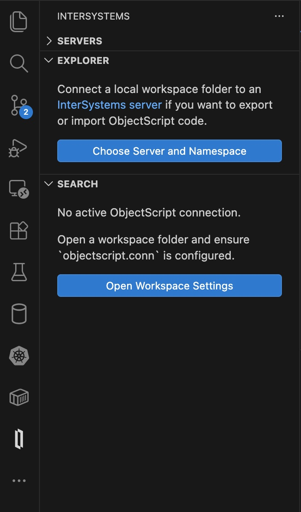
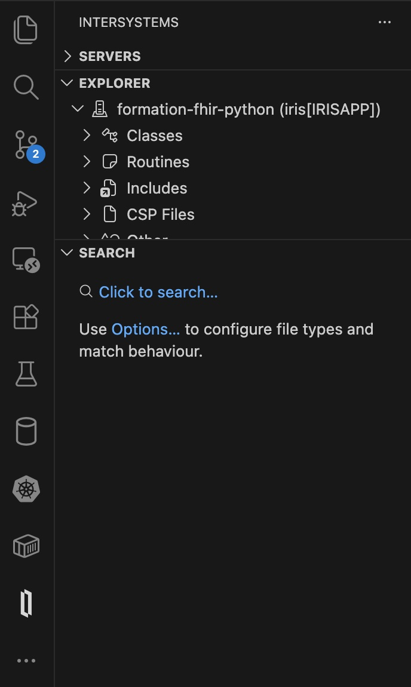
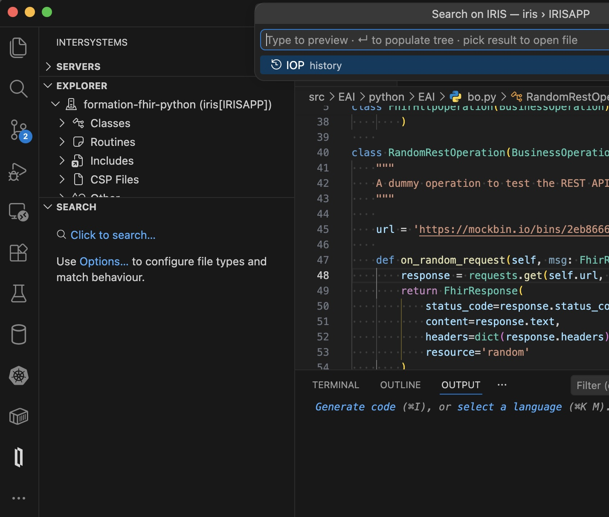
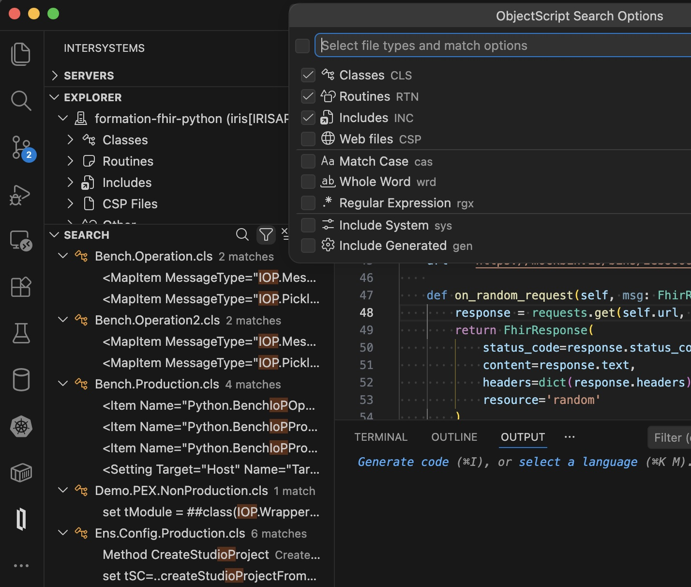
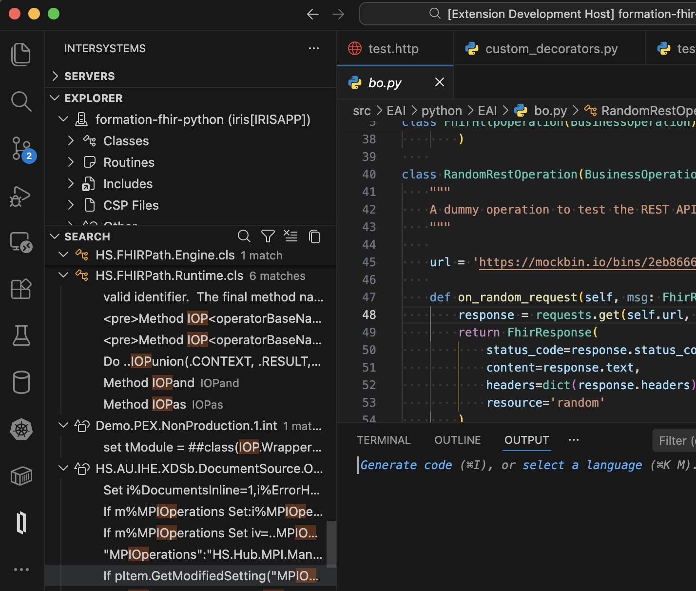
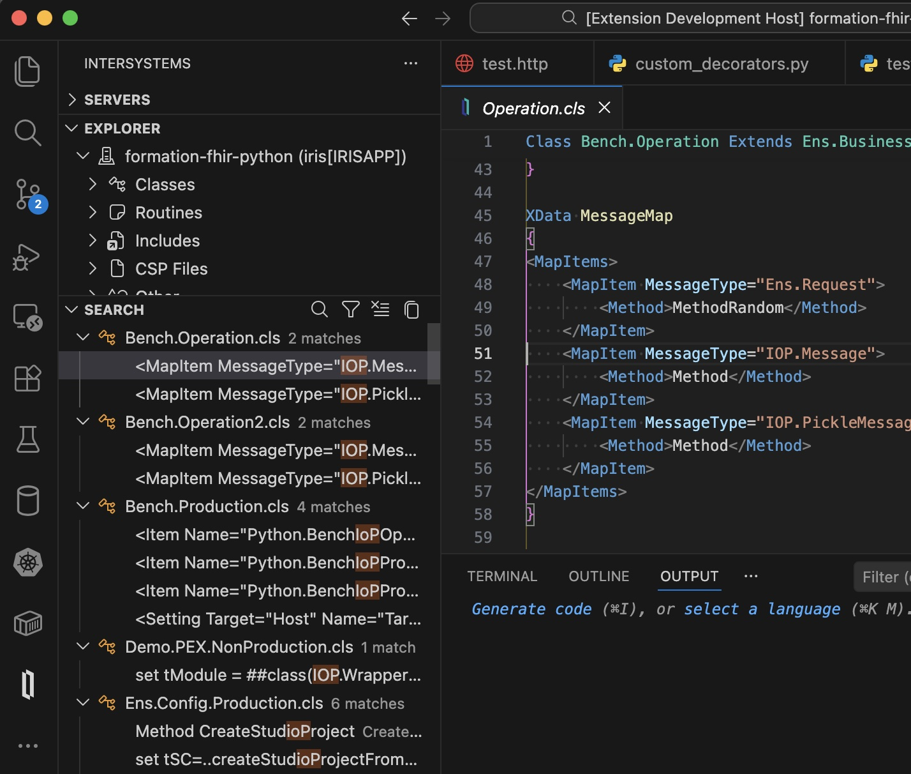

# ObjectScript Search


A VS Code extension that adds a **Search** panel to the InterSystems activity bar, enabling full-text server-side search across classes, routines, includes, and web files on an IRIS instance — directly from the same sidebar as the **Explorer** and **Servers** views.

---

## Features

| Feature | Details |
|---|---|
| **Full-text search** | Search inside class definitions, routines, includes, and web files |
| **Match options** | Toggle case-sensitive, whole-word, and regular-expression matching |
| **Type filters** | Toggle Classes, Routines, Includes, and Web (CSP) files independently |
| **Streaming results** | Results appear progressively as the server returns batches |
| **Live preview** | The search picker shows matching file names as you type |
| **Click to open** | Click any result to open it read-only in the ObjectScript editor |
| **Cursor positioning** | Match items scroll the editor to the exact matched line |
| **Match highlights** | Query text is highlighted in both file names and match lines |
| **Search history** | Last 20 queries are saved per workspace |
| **Copy results** | Export the full result list to the clipboard as Markdown |
| **Status bar** | Shows match/file counts after each search |
| **Native UI** | Follows VS Code's color theme automatically |

## Screenshots

**No active connection** — the panel guides you to configure `objectscript.conn`:



**Ready to search** — once connected, click to open the search picker:



**Search picker with history** — previous queries are shown instantly; results stream in as you type:



**Options panel** — toggle document types and match behaviour per workspace:



**Search results** — classes and routines listed with per-file match counts and highlighted snippets:



**Click to go to line** — clicking a match item opens the document and jumps the cursor to the exact matched line:



---

## Requirements

Both extensions below are **required** and are automatically installed as dependencies.

| Extension | Purpose |
|---|---|
| [`intersystems-community.servermanager`](https://marketplace.visualstudio.com/items?itemName=intersystems-community.servermanager) | Manages IRIS server connections and keychain authentication |
| [`intersystems-community.vscode-objectscript`](https://marketplace.visualstudio.com/items?itemName=intersystems-community.vscode-objectscript) | Provides the `objectscript://` document provider used to open results |

## Setup

### 1 · Configure your server

Define your IRIS server in **User Settings** (or `intersystems.servers` in `.vscode/settings.json`):

```jsonc
// .vscode/settings.json
{
  "intersystems.servers": {
    "my-iris": {
      "webServer": {
        "host": "localhost",
        "port": 52773,
        "scheme": "http"
      },
      "username": "SuperUser"
    }
  }
}
```

### 2 · Activate the connection for your workspace

```jsonc
// .vscode/settings.json
{
{
  "objectscript.conn": {
    "active": true,
    "server": "my-iris",
    // Or
    "host":"localhost",
    "port":52773,
    "username": "_IRIS_USERNAME_",
    "password": "_IRIS_PASSWORD_",
    // Or
    "docker-compose": {
        "service": "iris",
        "internalPort": 52773
     },
    "ns": "USER"
  }
}
}
```

> **Tip:** You can also use the inline `host`/`port`/`username`/`password` fields in `objectscript.conn` without defining a named server.

### 3 · Open the Search panel

Click the InterSystems icon in the Activity Bar and expand the **Search** section.

## Extension Settings

| Setting | Default | Description |
|---|---|---|
| `objectscriptSearch.maxResults` | `100` | Maximum results returned per search (1–1000) |
| `objectscriptSearch.includeSystem` | `false` | Include `%`-prefixed system documents by default |
| `objectscriptSearch.allowSelfSignedCertificates` | `false` | Accept self-signed TLS certificates |

## Search Options

Click the **Options…** (filter) icon in the view title bar to configure per-workspace options. Settings are persisted to workspace state across sessions.

| Option | Description |
|---|---|
| **Classes / Routines / Includes / Web files** | Toggle which document types to include |
| **Match Case** | Case-sensitive matching |
| **Whole Word** | Restrict matches to whole words |
| **Regular Expression** | Treat the query as a regex pattern |
| **Include System** | Include `%`-prefixed system documents |
| **Include Generated** | Include compiler-generated documents |

## How It Works

The extension calls the InterSystems Atelier REST API directly against the active IRIS server:

- **IRIS API v6+** — queues an asynchronous search job via `POST /api/atelier/v6/{ns}/work` and polls until complete, yielding result batches progressively.
- **Older servers** — falls back to `GET /api/atelier/v2/{ns}/action/search`, issuing one request per selected file-type mask.

In regex mode the server matches the full line, so the query is automatically wrapped to align with IRIS regex semantics.

## Opening Results

Clicking a file item or match item opens the document **read-only** via the `objectscript://` URI scheme, using vscode-objectscript's built-in `DocumentContentProvider`. For match items, the editor scrolls to and positions the cursor at the matched line.

> A workspace folder with an active `objectscript.conn` configuration must be open for results to be openable.

## Multiple Namespaces

When more than one workspace folder has an active ObjectScript connection, a namespace picker is shown before each search so you can target the correct server and namespace.

## Development

```bash
git clone https://github.com/grongierisc/vscode-objectscript-search
cd vscode-objectscript-search
npm install
npm run compile
# Press F5 in VS Code to launch the Extension Development Host
```

## License

MIT
